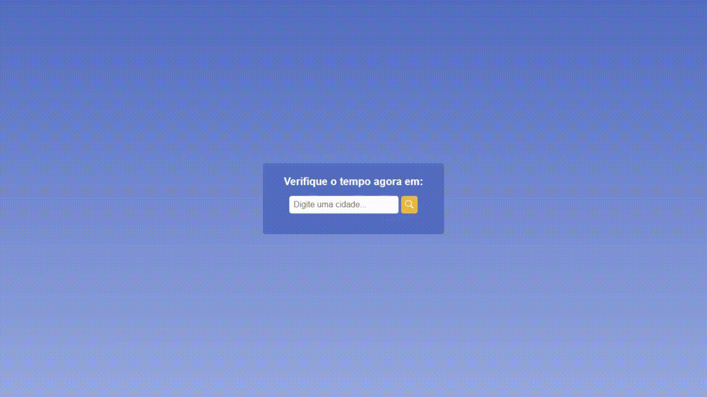

# Current Weather App

## Table of contents

- [Overview](#overview)
  - [The challenge](#the-challenge)
  - [Screenshot](#screenshot)
  - [Links](#links)
- [My process](#my-process)
  - [Built with](#built-with)
  - [Author](#author)

## Overview

### The challenge

Create a website to fetch weather info from an API and display it in a stylish way for the user.

### Screenshot

### Links

- Live Site URL: [Check it here](https://heiderick13.github.io/weather-app/)

## My process

### Built with

- Vanilla JavaScript

## Author

- Marcelo Oliveira - [LinkedIn](www.linkedin.com/in/marcelo-ferreira-de-oliveira)
